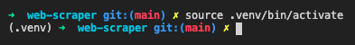

## Web-scraper for pyhton (Python 웹스크랩) 


   

참고자료: https://nomadcoders.co/python-for-beginners  

------
&nbsp;


## 웹스크랩(Web Scrap)이란? 📖

* 웹 사이트에서 데이터를 추출하는데 사용되는 데이터 스크래핑(컴퓨팅 기술)

* 웹문서(사이트)는 통상 텍스트와 이미지가 혼합되어 있는 HTML형식으로 구성됨
* 웹스크래핑은 비구조화된 웹문서 자료를 정형화된(구조화된) 형태로 변환하여 데이터베이스나 스프레드시트에 저장, 분석할 수 있도록 하는 것  
&nbsp;

> 웹 스크래핑 예시  

👉 &nbsp; Facebook에서 뉴스기사 스크랩 

  

&nbsp;
 > 웹 스크래핑 예시 2 

👉 &nbsp; Google Chorme에서 검색 항목 모두 스크래핑


&nbsp;

## 프로젝트 소개 🧑🏻‍💻

* 구직사이트 Indeed와 Stackoverflow에 있는 Python 구직 정보 스크랩핑하기
* 스크래핑한 모든 일자리 정보를 엑셀 시트에 옮기기 

&nbsp;

## 환경설정  (본인은 Mac환경에서 작업) 

### 1. Python 가상환경 설치

👉 &nbsp; 현재폴더(`.`)에 가상환경명(`venv`)으로 생성

```shell
$ python3 -m venv .venv
```

&nbsp;

### 2. 가상환경 실행(Virtual Environment Activate)

```shell
$ source .venv/bin/activate
```

👉 &nbsp; 가상환경 생성을 하면 프로젝트 폴더 앞에 `(.venv)` 와 같은 표시가 뜸
    

    
&nbsp; 
👉 &nbsp; 가상환경 실행을 중단하고 싶으면 아래의 명령어 입력 
```shell
$ deactivate
```
&nbsp;

### 3. `pip` 버전 업그레이드
👉 &nbsp; 다른 모듈들을 설치하기 위해 pip을 최신버전으로 업그레이드 한다 

```shell
$ pip install --upgrade pip
```

&nbsp;

### 4. requests 모듈 설치

참고: https://requests.readthedocs.io/en/master/
&nbsp;

 🙋🏻 &nbsp;requests 모듈은 HTTP 요청을 보내는 pyhton 모듈이다. 웹문서 뿐만아닌 API를 개발할 때도 유용하게 이용된다.


👉 &nbsp; requests 모듈 조회 
```shell
 $ pip show requests
```
 &nbsp;

 👉 &nbsp; 다음과 같은 이미지가 나타난다면 

   

 &nbsp;

 👉 &nbsp; 모듈을 설치해준다.
```shell
 $ pip install requests
```

 &nbsp;

 👉 &nbsp; 기본 사용법
```python
 import requests

 URL = requests.get("https://www.indeed.com/q-python-jobs.html")

```

&nbsp;

### 5.BeautifulSoup 모듈 설치
  
참고: https://www.crummy.com/software/BeautifulSoup/bs4/doc/
&nbsp;

🙋🏻 &nbsp;beautifulsoup4 모듈은 웹크롤러라고도하며 requests 모듈을 통해 전달받은 html문서를 파싱(parsing)하는 역할을 한다


👉 &nbsp; 모듈을 설치해준다.
```shell
$ pip install beautifulsoup4
```

👉 &nbsp; 기본 사용법
```python
import requests
from bs4 import BeautifulSoup

URL = requests.get('URL~')

## soup은 html 데이터를 추출하는 도구라고 하겠다.
soup = BeautifulSoup(URL.text, 'html.parser') 
## 첫번째 인자값에는 추출한 url에 데이터를 text로 변환해줘야함

## prettify() 메서드는 html문서를 보기좋게 정렬해준다
print(soup.prettify())

## 자세한 기능은 참조한 url 참고

```
&nbsp;