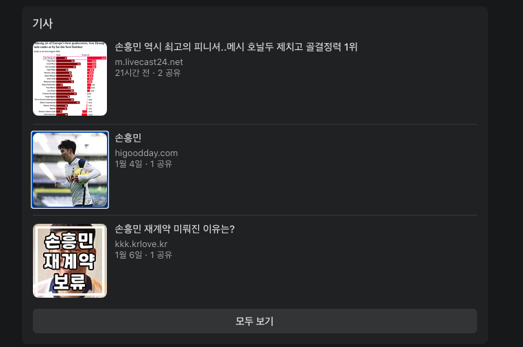

## Web-scraper for pyhton (Python 웹스크랩) 

 

참고: https://nomadcoders.co/python-for-beginners  

------

## 웹스크랩(Web Scrap)이란? 📖

* 웹 사이트에서 데이터를 추출하는데 사용되는 데이터 스크래핑(컴퓨팅 기술)

* 웹문서(사이트)는 통상 텍스트와 이미지가 혼합되어 있는 HTML형식으로 구성됨
* 웹스크래핑은 비구조화된 웹문서 자료를 정형화된(구조화된) 형태로 변환하여 데이터베이스나 스프레드시트에 저장, 분석할 수 있도록 하는 것

> 웹 스크래핑 예시 1 

👉  Facebook에서 뉴스기사 스크랩

 > 웹 스크래핑 예시 2 

👉  Google Chorme에서 검색 항목 모두 스크래핑

